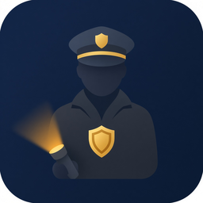

# Night Watchman

**GitHub:** https://github.com/heatvent/ha-night-watchman

  

Custom integration that walks the house at night. You pick the devices, the same way Presence Simulation lets you pick the lights it uses.

A round is skipped while any **activity** device has changed during the quiet period. Sitting on does not count. Leave washer, dryer, power strips, and indicator LEDs out of that list.

When a round runs:

- Selected lights that are still on are turned off, along with any switches you added, such as a coffee maker.
- Each lock is turned only when its door contact is closed.
- Report-only contacts are named in the phone message. Nothing closes them.

---

## Install

### HACS

1. **HACS → Integrations → ⋮ → Custom repositories**
2. URL: `https://github.com/heatvent/ha-night-watchman` · Category: **Integration**
3. Download **Night Watchman**, then **restart** Home Assistant
4. **Settings → Devices & services → Add integration → Night Watchman**

HACS follows **GitHub Releases** (`v1.0.7`, …), not the tip of `main`.

### Manual

Copy only `custom_components/night_watchman` into your Home Assistant `custom_components` folder. Do not copy the rest of this repo, and do not rename the folder.

---

## Setup

| Setting | What it does |
|---|---|
| First round / last round | Window when rounds are allowed. Default is 1:00 AM through 5:00 AM. |
| Minutes between rounds | How often a round is attempted inside that window. Default is 60. |
| Quiet period | How long every activity device must stay unchanged before a round proceeds. Default is 45 minutes. |
| Notify service | Home Assistant notify service, for example `phones_group`. A message is sent only when something was locked, turned off, or left open. |
| Lights / motion / doors to ignore | Everything else in that category is monitored, including camera motion. A recent change skips the round. Ignore indicator LEDs, light groups, and timer lights. |
| Also turn off the monitored lights | Turns off every monitored light when a round runs. |
| Lights to leave on | Bedrooms and lamps to keep on even when that box is checked. |
| Other devices to turn off | Extra lights or switches, such as a coffee maker or 3D printer. Do not add strips that should stay on. |
| Door 1–4 lock and contact | If the lock is unlocked and that contact is closed, the round locks it. An open contact is reported and left unlocked. Do not add the garage overhead door. |

After the entry exists, use the integration page to add more rows:

| Add | What it does |
|---|---|
| Lock if the door is closed | Hubitat lock plus the contact that must read closed before the lock runs. An open contact is reported and left unlocked. |
| Report if open | Contacts such as patio doors or a gate. They are named in the message and are not locked or closed. |

The garage overhead door should not be added. Closing it from Home Assistant can shut it on someone in the opening.

---

## Updates

Each release tag is `v` plus the version in `custom_components/night_watchman/manifest.json`. Version `1.0.7` is tag `v1.0.7`. Bump both together. HACS offers the new release. Restart Home Assistant after installing it.
